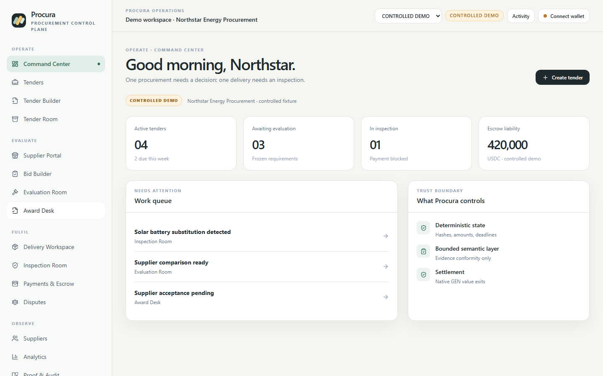

# Procura

## Procurement you can prove.

Procura is a verifiable procurement operating application from frozen requirement to deterministic value settlement. It combines authenticated supplier evidence with bounded GenLayer semantic judgment while identity, lifecycle, amounts, deadlines, access control, escrow, refunds, and payouts remain deterministic.

[](https://github.com/GIFTEDLOV/procura/actions/workflows/release.yml) [](https://github.com/GIFTEDLOV/procura/releases/tag/v1.0.1) [](https://procura-kappa-two.vercel.app)

**[Open the live application](https://procura-kappa-two.vercel.app)** · **[Read v1.0.1](https://github.com/GIFTEDLOV/procura/releases/tag/v1.0.1)** · **[Inspect proof & audit](https://procura-kappa-two.vercel.app/app/proof-audit)**



## What Procura solves

Procurement decisions fail when requirements drift, evidence is unauthenticated, semantic interpretation is overextended, or value movement cannot be reconciled. Procura keeps those boundaries explicit and reviewable.

## Product workflow

**Requirement → Bid → Evaluate → Award → Deliver → Inspect → Settle**

Teams author and freeze requirements, suppliers submit typed bids and evidence, buyers evaluate objective and bounded semantic requirements, awards create deterministic obligations, delivery evidence is inspected against the award, and escrow exits only through permitted refund or payout paths.

## Why GenLayer

GenLayer is used only for bounded semantic judgments over frozen, authenticated evidence. It does not decide identity, access, amounts, deadlines, lifecycle transitions, or payment policy. Successful semantic results are strict canonical records with replay protection; failed or undetermined attempts do not become business verdicts.

## Deterministic trust boundary

- **Deterministic layer:** identities, roles, state transitions, deadlines, amounts, and access control.
- **Authenticated evidence layer:** source identity, URLs, hashes, byte lengths, timestamps, and frozen evidence roots.
- **Bounded semantic layer:** strict JSON result schemas and immutable adjudication identities.
- **Deterministic settlement layer:** native GEN escrow, fees, refunds, payouts, and conservation.

## Live deployment

| Field | Value |
| --- | --- |
| Network | Studio-dev |
| Chain | 61997 |
| Contract | `0x88634c7868B0659b46C5bd93E4038222697a0170` |
| Contract SHA256 | `daad9b0c43be603e522afbf55623e7b8027d7de3b01708922360ae5a45972cde` |
| Deployment tx | `0x5ceef949b50a184d9f5675a174ee6b329acdf61bbb05b853392b5e55b29ba34d` |
| Interface | 39 public methods / 39 schema methods |

## Live qualification proof

- Bid semantic result: `COMPLIANT` — [`0xc1df…c990cbb6`](https://studio-dev.genlayer.com/tx/0xc1dfbb2ab71c6f5760834bf6607aaea81e7088daab95546b289592c0c990cbb6)
- Delivery semantic result: `DELIVERY_ACCEPTED` — [`0x13d0…b72a55935`](https://studio-dev.genlayer.com/tx/0x13d0dcc025a08e51d2d0103d42b72eced5d387466efe83ef6183143b72a55935)
- Buyer refund: `1000000000000000 wei` — [`0x2b71…cb46a536`](https://studio-dev.genlayer.com/tx/0x2b71e96260acc5b07f82ee4eabdfccf85e079575a24795339d6baf62cb46a536)
- Supplier payout: `1000000000000000 wei` — [`0x46c0…b7b4ff18`](https://studio-dev.genlayer.com/tx/0x46c000b3ac9d5034d74b54a20a96f1a8b1299ca8c15929d5e168aac4b7b4ff18)
- Successful-result replay guards: bid `PASS`, delivery `PASS`
- Final qualification accounting: funded `2e15`, payouts `1e15`, refunds `1e15`, escrow `0`, bond `0`, contract balance `0`, unexplained `0`.

## Product surfaces

The application includes Command Center, Tenders, Tender Builder, Tender Room, Supplier Portal, Bid Builder, Evaluation Room, Award Desk, Delivery Workspace, Inspection Room, Payments & Escrow, Disputes, Suppliers, Analytics, Proof & Audit, and Settings.

The UI has explicit **LIVE**, **CONTROLLED DEMO**, and **HISTORICAL PROOF** modes. LIVE reads do not fall back to fixture data. Public reads do not require a wallet; writes use the typed adapter, role/network guards, one-broadcast transaction engine, persisted hash recovery, and canonical readback.

## Architecture

```text
frontend → typed adapter → transaction/recovery engine → Procura contract
                         ↘ canonical read layer → LIVE / DEMO / HISTORICAL UI
```

## Security model

Procura is fail-closed at the semantic and value boundaries. It does not extract arbitrary JSON from prose, treat finality as execution success, retry a broadcast after a hash, or allow a finalized semantic result to be adjudicated again. See [SECURITY.md](SECURITY.md), [docs/CHRONICLE_RECURRENCE_AUDIT.md](docs/CHRONICLE_RECURRENCE_AUDIT.md), and [docs/LIVE_PROOFS.md](docs/LIVE_PROOFS.md).

## Testing

The release is covered by the current exact-head Python contract suite, adversarial/property/semantic/accounting suites, 24/24 mutation kills, storage/nondeterminism/JSON/fee regressions, 54 frontend unit tests, cross-component integration, transaction recovery, expanded Playwright browser coverage, typecheck, build, and secret scan. Exact rerun counts are recorded in [docs/TESTING.md](docs/TESTING.md) and CI.

## Local development

```powershell
cd frontend
pnpm install
pnpm dev
pnpm test
pnpm typecheck
pnpm build
pnpm e2e
```

## Repository structure

- `contracts/` — frozen Procura intelligent contract and interface artifacts.
- `frontend/` — React/Vite product application and typed GenLayer adapter.
- `tests/` — contract and browser tests.
- `scripts/` — reusable qualification and verification code.
- `evidence/` — current, historical, controlled, and raw provenance records.
- `docs/` — current release documentation, Chronicle audits, and reviewer screenshots.

## Evidence and provenance

Start with [evidence/README.md](evidence/README.md), [docs/LIVE_DEPLOYMENT.md](docs/LIVE_DEPLOYMENT.md), and [docs/LIVE_PROOFS.md](docs/LIVE_PROOFS.md). Superseded deployments remain documented as historical; they are not current contract state.

## Release

`v1.0.1` is the product/frontend/repository completeness release using the same frozen contract and deployment as `v1.0.0`. The release adds the Procura landing page, complete application routing and surfaces, canonical LIVE reads, wallet/role UX, transaction recovery presentation, documentation cleanup, and expanded browser coverage. It does not change contract source or redeploy.

## Known tooling limitation

Nine stale `E014 gl.storage.allow` diagnostics remain documented as tooling false positives. They do not describe the deployed runtime and do not change the frozen source, live qualification, or accounting proof.
